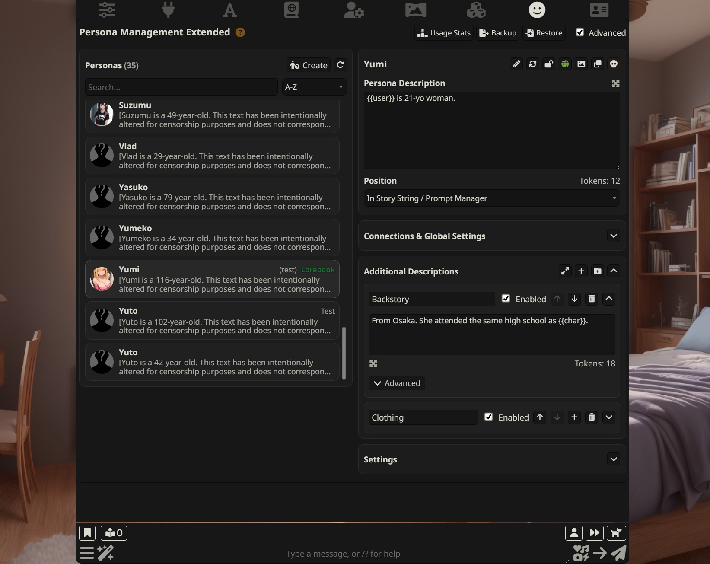

# Persona Management Extended (PME) — SillyTavern Extension

Persona Management Extended upgrades SillyTavern’s **Persona Management** with an optional **Advanced mode**.

## Motivation

If you’ve been roleplaying with multiple personas for a while, you’ve probably hit the same pain points:
you want to quickly add **context** (outfits, scene details, lore, rules, mood, etc.) without turning your main persona description into a mess.

I previously made **User Persona Extended**. It was a good idea and helped a lot — but it also had **fundamental limitations** in its core approach and a set of bugs that I couldn’t reliably fix over time.

So I decided to start over from scratch and rethink the extension properly:

- Instead of trying to “patch” the existing Persona Management UI, PME provides its own **Advanced UI** for persona management.
- This gives me the freedom to build features the way I believe they should work, with a cleaner experience.
- It also makes new features easier to implement because PME is **less dependent on SillyTavern’s original UI and implementation details**.

It helps you:

- Manage personas faster (search, sorting, better overview)
- Keep **scenario-specific persona add-ons** as toggleable blocks (**Additional Descriptions**)
- Automatically enable persona add-ons depending on the **current chat** or **current character**
- Keep your base persona clean: prompt changes are applied **only during generation**

> PME does **not** patch SillyTavern core files. You can always switch back to the default UI.

---

## What you get

### Advanced mode (inside Persona Management)

When Advanced mode is ON, SillyTavern’s default Persona Management content is hidden and replaced with PME’s UI:

- **Personas list (left)**:
  - Search
  - Sorting (A–Z, ID, description length, connections count, lorebook first/last)
  - Description preview
  - Lorebook badge
- **Current persona panel (right)**:
  - Edit Persona Description
  - See token count
  - Choose where the persona description goes (Prompt / Author’s Note / In-chat @ Depth, etc.)
  - Quick actions: rename, duplicate, delete, image, lorebook
- **Connections & Global Settings**:
  - The native SillyTavern controls are shown inside PME (so everything works the same)
- **Additional Descriptions**:
  - Add unlimited **items** and **groups**
  - Enable/disable, collapse, delete
  - Manual reorder (up/down)
  - Fullscreen editor
  - Token count per block
- **Per-persona prompt settings**:
  - Optional wrapper template
  - Custom joiner between Additional Descriptions

### “Sync with original persona” (Linked / Unlinked)

Sometimes you want an “extended” persona description that you don’t want to permanently store as the original (for example, when experimenting).

PME lets you toggle:

- **Linked**: you edit the original persona description like normal.
- **Unlinked**: you edit an **extended local version** for this persona. You can later re-link and choose:
  - **Use original** (discard extended changes), or
  - **Use extended** (apply extended to the original).

---

## How prompt injection works (simple explanation)

When you generate a message, PME builds a **final persona text** like this:

1. Take the persona description (original or extended, depending on Linked/Unlinked)
2. Append all **enabled Additional Descriptions** (in your chosen order)
3. Optionally wrap it with a template (if enabled)

This final text is applied **temporarily** for the generation, then restored.

So your saved persona description is not permanently “polluted” by injected text.

---

## Installation

Install via SillyTavern’s extension installer using the repository URL:

`https://github.com/dmitryplyaskin/SillyTavern-Persona-Management-Extended`

---

## Import from User Persona Extended (migration)

If you used **User Persona Extended** before, you don’t have to manually recreate your blocks.

In **Extensions → Persona Management Extended**, click **Import from User Persona Extended**:

- PME will automatically import **all your saved Additional Descriptions** from the old extension.
- It keeps the **title / text / enabled state** and preserves the original order.
- Your existing PME blocks are not deleted — imported items are added on top.

This is the fastest way to move to PME without copy/pasting everything by hand.

---

## Quick start

1. Open **Extensions** settings in SillyTavern.
2. Find **Persona Management Extended** and make sure **Enable extension** is ON.
3. Open **Persona Management**.
4. Turn on the **Advanced** toggle (near the Persona Management header buttons).
5. Select a persona and add a few **Additional Descriptions**:
   - Click **+** to add an item
   - Click **G+** to add a group
6. Enable the blocks you want and generate a message — your enabled blocks will be included automatically.

---

## Using Additional Descriptions

Additional Descriptions are extra text blocks that PME can append after your main persona description.

- **Items**: a single block of text.
- **Groups**: a folder with multiple items inside (useful for themes like “Outfit”, “Lore”, “Setting rules”).

### Order matters

PME injects blocks **in the exact order you see in the list**.
Use the **up/down arrows** to reorder.

### AUTO activation (optional)

Any item or group can be switched into **AUTO** mode:

- **Connections**: auto-enable when the current chat or character matches your bindings.
  - “Add chat” grabs the current chat (or you can enter an id manually)
  - “Add character” binds to the current character
- **Match rule**: auto-enable when a text or `/regex/flags` matches the **current character’s description**

When AUTO is enabled, the manual “Enabled” toggle is replaced by an **AUTO** badge (activation is controlled by the rules).

---

## Settings (per persona)

In Advanced mode, open the **Settings** card:

- **Wrapper**:
  - When enabled, PME inserts the final persona prompt into your template by replacing `{{PROMPT}}`.
  - Example: `<system>{{PROMPT}}</system>`
- **Additional Descriptions joiner**:
  - Controls how blocks are joined.
  - Default is `\n\n` (blank line).
  - Supports `\n`, `\t`, `\r`, and `\\`.

---

## Extension settings (global)

In **Extensions → Persona Management Extended**:

- **Enable extension**: master toggle (when OFF, PME won’t affect generation)
- **Import from User Persona Extended**: automatically imports your Additional Descriptions from the old extension
- **Clear All Extension Data**: deletes PME data for all personas (with confirmation)

---

## Notes about data & backups

- PME saves data **per persona**.
- Persona backup/restore in SillyTavern will also include PME data (because it’s stored inside persona metadata).

---

## Troubleshooting

- **I don’t see the Advanced toggle**

  - Open Persona Management once (the toggle is injected into that UI).
  - Make sure the extension is installed and enabled.

- **Additional Descriptions don’t show up in generations**

  - Check **Extensions → Persona Management Extended → Enable extension**.
  - Make sure blocks are enabled (or correctly configured in AUTO mode).

- **AUTO mode doesn’t activate**
  - If you use Connections: confirm you added the correct chat / character.
  - If you use Match: the rule matches the character’s **Description** field (not the name).

---

## License

See `LICENSE`.

## Author

Dmitry Plyaskin

## Support / Issues

Please use the GitHub repository page:
`https://github.com/dmitryplyaskin/SillyTavern-Persona-Management-Extended`
